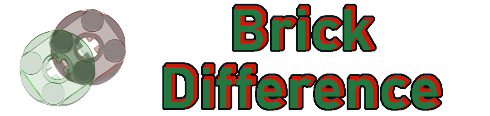
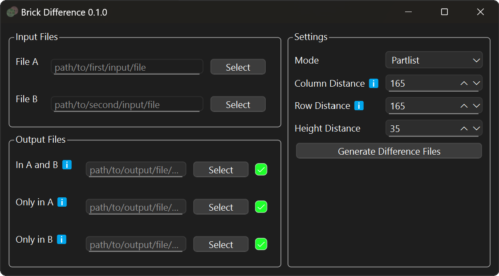

This is a graphical Python program for calculating the difference between two LDraw files(.ldr). 
This software is mostly written for LDraw files exported by Studio.

The Graphical Userinterface:

# Usage
This software usage take two LDraw files as inputs, lets call them file A and file B.
If you are using Bricklink Studio you heve to first expoert your .io file to LDraw(.ldr).
The input files can be selected in the "Input Files" area.
In the "Output Files" area you can choose wich files to generate(activated checkmark) and were they are saved.
There are 3 possible file that can be generated_
1. In A and B -> Everything that is in both input files
2. Only in A -> Only things that are in File A, but not File B
3. Only in B -> Only things that are in File B, but not File A
The output depends on the mode choosen:
- Partlist:
  - In this mode the partlists of both files are compared.
    The result ist saved in LDraw model were the parts are arrenged by parttype and colour.
- Difference Model;
  - In this mode the files are compared by the position of parts/submodels.
    If the position, colour or type of a brick is different it appears in the "Only in" files,
    otherwise its in the "A and B" file. 
    Something simular applies to submodels if their position/name changes, they also appear in the "Only in" files.
    If parts or further submodels change in a submodel(but not the position) 
    the unchanged parts of the submodels appear in the "A and B" file while the changes are in the "Only in" files.
    If the position, but not the content of a submodel changes, it appears unaltered in the "Only in" files.
    If  both the position and content, of a submodel change it appears renamed(random number appended) in the "Only in files".  

The mode can be choosen in the "Settings" area. There you can also choose distances for the grid used in partlist mode.
If you have set evereything up you just have to click "Generate Difference Files". None of the modes retain any LDraw meta commands from the original files(except submodel file headers in Difference model mode), including building steps.

# Run/Install:  
Currently there is only a installer for Windows Version(x86) and package installable through pipx/pip.  
Under Releases you find an installer and portable version for Windows and the package for pipx/pip.
If have an antivirus software installed it might warn you, when running the installer.  
To avoid the problems with an antivirus or for installation on Linux, Mac and possibly Windows on Arm(untested) follow the [manual installation guide](MANUALINSTALL.md),
which explains the installation with pipx.
# Supported filetypes:
- .ldr as in and output format
# Known "Issues":
- On MacOS: Terminal window in the background, since pipx uses it to run a virtual environment
